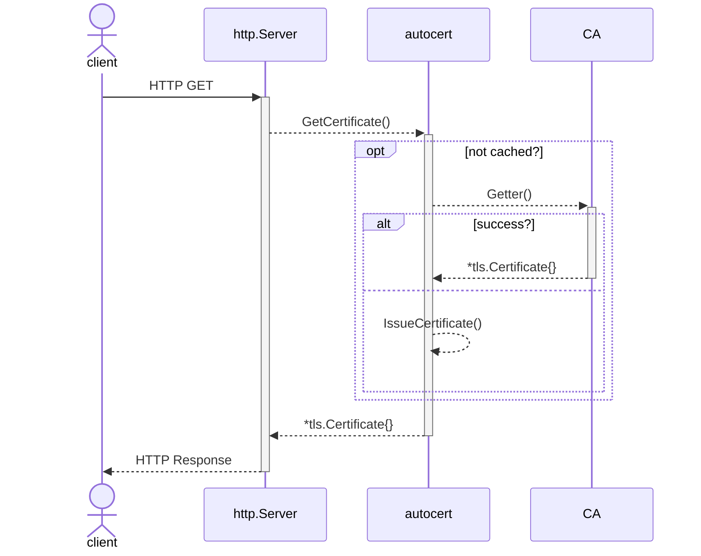

# autocert

`autocert` is a TLS store that falls back to self-signed if needed,
uses a callback to acquire new certs, and renews those about to expire.

## Sequence

```mermaid
sequenceDiagram
    actor client
    participant SRV as http.Server
    participant AC as autocert
    participant R as CA

    client ->>+ SRV: HTTP GET

    SRV -->>+ AC: GetCertificate()

    opt not cached?
    AC -->>+ R: Getter()
        alt success?
        R -->>- AC: *tls.Certificate{}
        else
        AC -->> AC: IssueCertificate()
        end
    end

    AC -->>- SRV: *tls.Certificate{}

    SRV -->>- client: HTTP Response
```

## Related Projects
